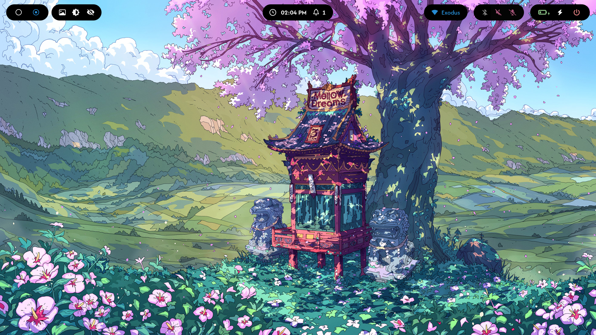
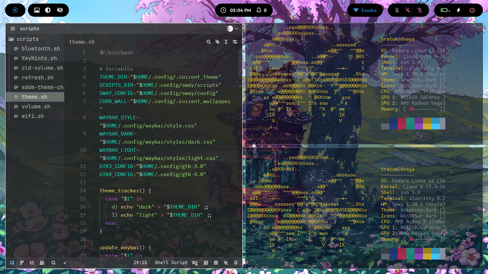
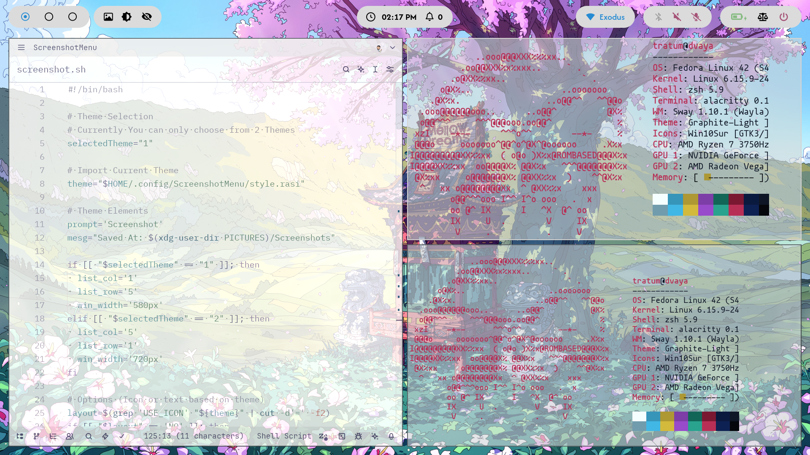
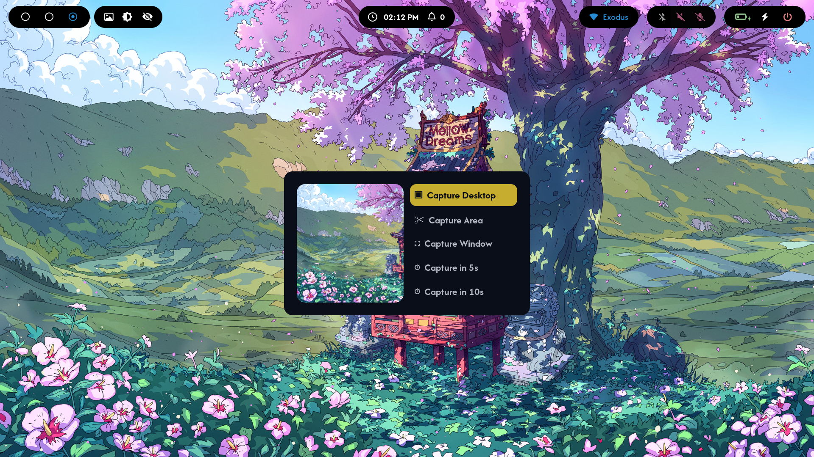
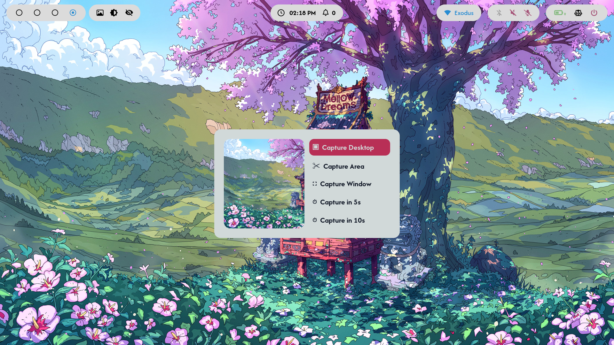
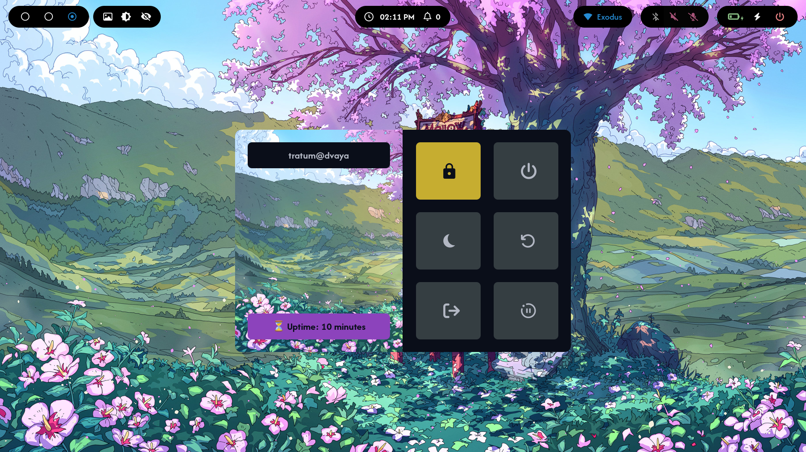
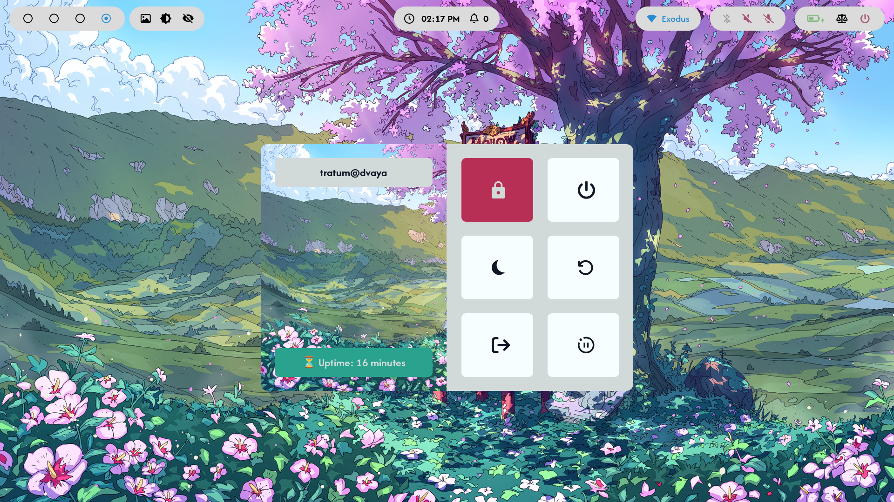
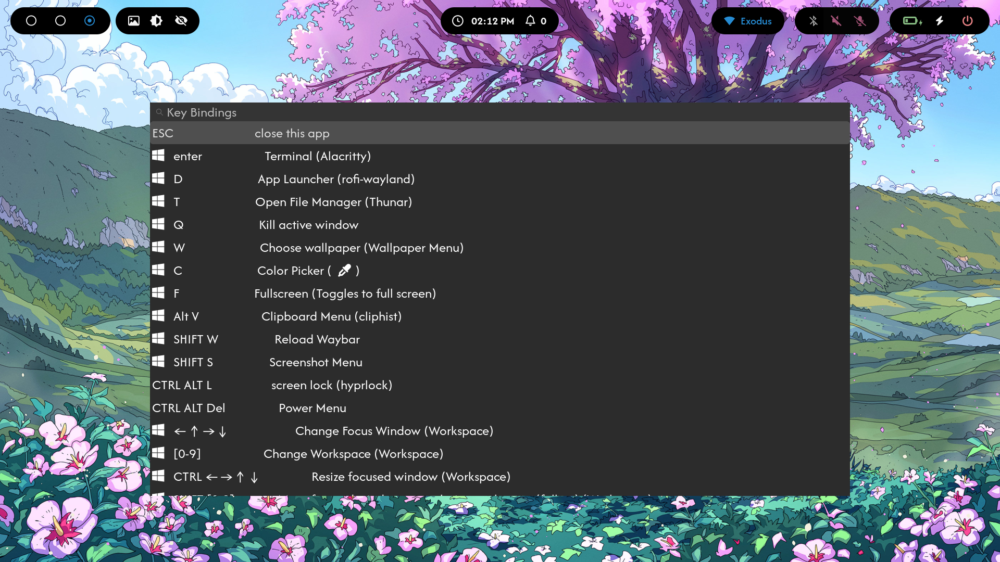
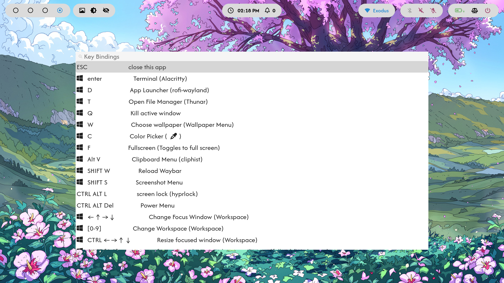
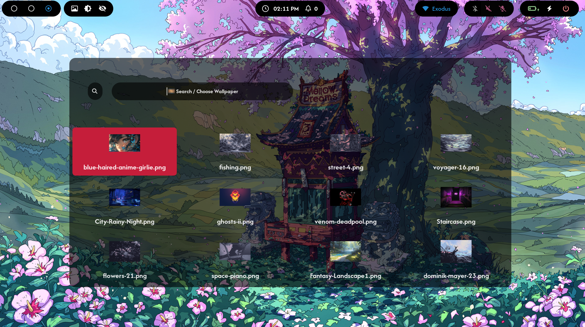

<h1 align="center">Tratux</h1>

### Contains `dotfiles` of Linux OS Used By Me. This repo is GNU Stow Compatible



<p float="center">
  
  
</p>
<p float="center">
  
  
</p>
<p float="center">
  
  
</p>
<p float="center">
  
  
</p>


<br>

### Steps To Replicate It For Your System

```bash
  sudo dnf install stow git -y
  cd Downloads
  git clone git@github.com:tratum/tratux.git dotfiles
  cd dotfiles
  stow */ ## to symlink all packages
```

### Updating and Restowing Your Configuration

```bash
  cd dotfiles
  git pull
  stow -R */   # Restow everything to apply changes
```

## Fedora Sway Branch

#### Appearence

- GTK Theme - `Graphite Dark / Graphite Light`
- Icon Theme - `Win10Sur / Win10Sur Dark`
- Cursor Theme - `Bibata-Modern-Ice`
- System Font - `Afacad Flux Medium`
- Terminal Font - `Mononoki Nerd Font`

#### List Of Applications Used

- Window Manager/Tiling Compositor - `Sway`
- Terminal - `Alacritty`
- PDF Viewer - `Papers`
- Application Launcher - `Rofi`
- Clipboard Manager - `cliphist`
- File Manager - `Thunar`
- Login Manager - `SDDM`
- Notification Daemon - `Dunst`
- Screen Lock - `Hyprlock`
- Screen Idle - `HyprIdle`
- Image Viewer - `gThumb`
- Screenshot Tools - `grim/slurp`
- Color Palette Generator - `Wallust`
- Status Bar - `Waybar`
- Wallpaper Manager - `swww`
- Web Browsers - `Brave` `Ungoogled chromium`
